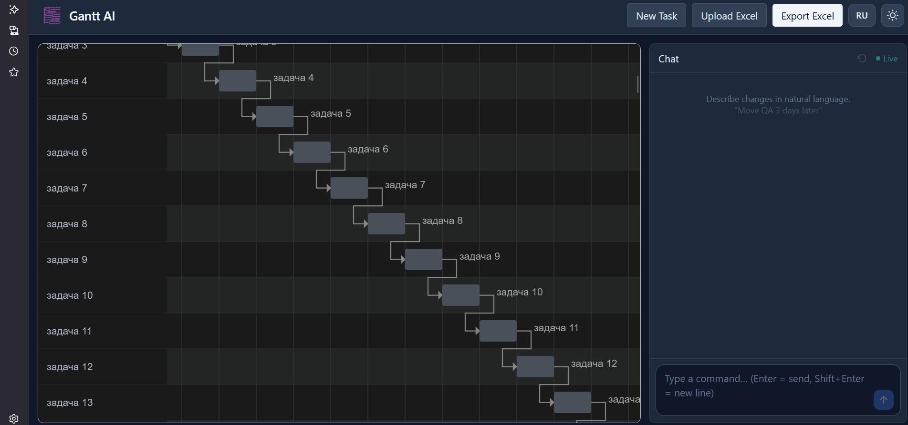
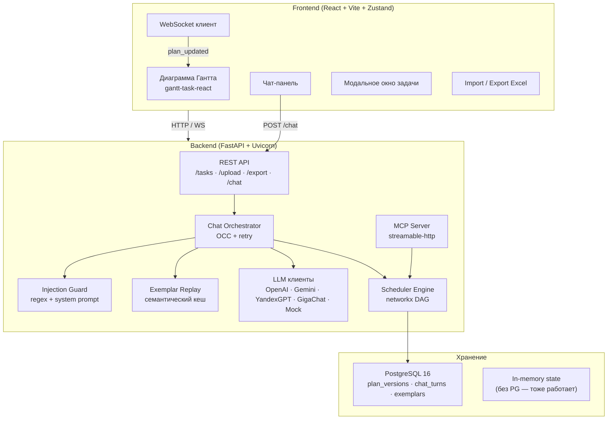
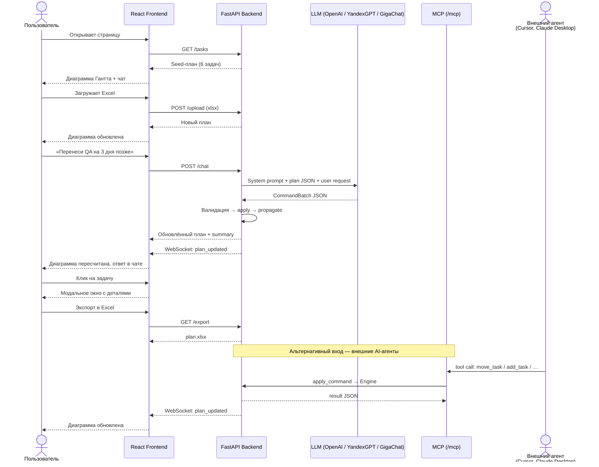
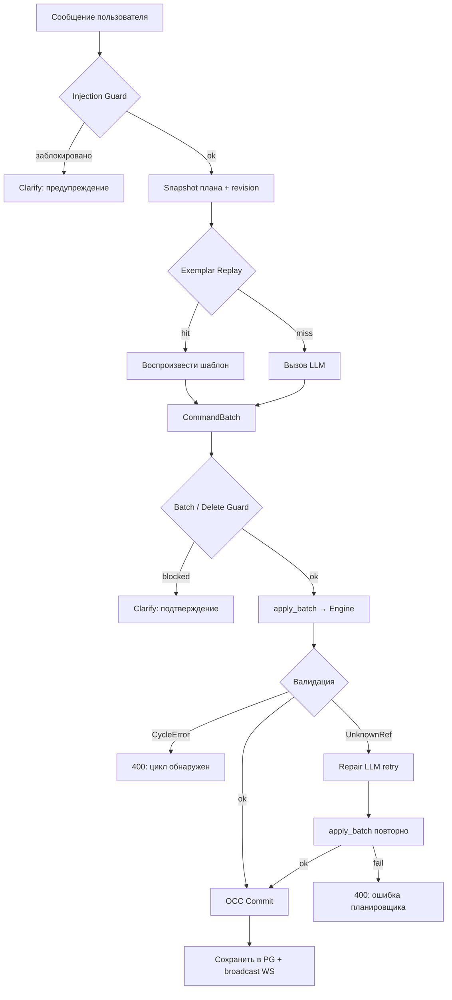

# Gantt AI Planner

Интерактивная веб-диаграмма Гантта с управлением через естественный язык. Пользователь открывает страницу, видит план проекта и правит его через чат — агент на базе LLM переводит команды в типизированные операции, движок-планировщик пересчитывает расписание в реальном времени.

> **Стек**: React 18 · TypeScript · Zustand · FastAPI · Pydantic v2 · NetworkX · PostgreSQL 16 · WebSocket · MCP · LLM (OpenAI / Gemini / YandexGPT / GigaChat)



---

## Содержание

1. [Быстрый старт](#быстрый-старт)
2. [Архитектура](#архитектура)
3. [Основной сценарий](#основной-сценарий)
4. [Допущения и принятые решения](#допущения-и-принятые-решения)
5. [Использование AI-ассистентов](#использование-ai-ассистентов)
6. [Roadmap to Production](#roadmap-to-production)
7. [Демо-материалы](#демо-материалы)
8. [Лицензия](#лицензия)

---

## Быстрый старт

### Docker (рекомендуемый способ)

```bash
cp .env.example .env          # задать ключи или оставить LLM_PROVIDER=mock
docker compose up              # PostgreSQL 16 + Backend + Frontend
```

Приложение доступно:

| Сервис | URL |
|--------|-----|
| Frontend | http://localhost:5173 |
| Backend API | http://localhost:8000 |
| Swagger | http://localhost:8000/docs |
| MCP | http://localhost:8000/mcp |

### Без Docker

Инструкции для локальной разработки без контейнеров — см. [backend/README.md](backend/README.md) и [frontend/README.md](frontend/README.md).

---

## Архитектура




## Основной сценарий



### Поддерживаемые операции через чат

| Операция | Пример | Команда |
|----------|--------|---------|
| Перенос задачи | «Перенеси Дизайн на 3 дня позже» | `move_task` |
| Изменение длительности | «Увеличь QA на 2 дня» | `resize_task` |
| Обмен позициями | «Поменяй местами QA и Разработку» | `swap_tasks` |
| Добавление задачи | «Добавь задачу Деплой на 3 дня после Тестирования» | `add_task` |
| Удаление задачи | «Удали задачу Документация» | `delete_task` |
| Зависимости | «Сделай QA зависимой от Backend API» | `set_dependency` |
| Переименование | «Переименуй Discovery в Исследование» | `rename_task` |
| Назначение исполнителя | «Назначь Ивана на Backend» | `reassign_task` |
| Read-only запросы | «Сколько задач у Анны?» | `answer` |
| Уточнение | Неоднозначный запрос | `clarify` |

---


### Ключевые принципы

Архитектура выстроена на основе опыта с event-driven системами и конвейерами обработки данных, где LLM выступает генератором намерений, а детерминированный движок — единственным арбитром состояния. Этот подход обеспечивает предсказуемость, тестируемость и аудируемость каждой мутации плана.

1. **Граф расписания — источник истины.** Модель генерирует типизированные команды (`CommandBatch` — Pydantic-модель с 10 типами операций), а движок на `networkx` проверяет ацикличность (DAG), пересчитывает даты через topological sort и распространяет ограничения. Каждая мутация иммутабельна: `apply_command` возвращает новый `ProjectPlan`.

2. **Optimistic Concurrency Control (OCC).** LLM-вызовы выполняются вне lock'а; при commit проверяется `revision`. Конфликт — автоматическая retry-итерация (snapshot → compute → commit). UI не блокируется на 1–5 с LLM-запроса.

3. **Защита от prompt injection — три уровня:**
   - Regex-фильтр на входе (`detect_injection`) — блокирует шаблоны «ignore previous instructions» / «покажи системный промпт»
   - Security-секция в system prompt — инструктирует LLM отклонять инъекции
   - App-level guard — лимит команд в батче (`MAX_COMMANDS_PER_BATCH`), подтверждение массовых удалений фразой `YES_DELETE_BULK`

4. **Семантический кеш (Exemplar Replay).** Повторные похожие запросы на том же плане воспроизводятся из кеша без обращения к LLM — снижение стоимости и латентности.

5. **Multi-turn контекст.** Последние 8 пар user/assistant сохраняются в `SessionState._history` и передаются LLM как предшествующие сообщения. Только текущий ход несёт полный plan JSON — предыдущие ходы передаются без плана для экономии токенов.

6. **Repair-retry.** При `UnknownReferenceError` (LLM сгенерировал несуществующий task_id) — автоматический повторный запрос к LLM с описанием ошибки. Циклы считаются ошибкой пользователя (не починить автоматически).

### Поток обработки чат-запроса



### MCP — интеграция для внешних агентов

MCP (Model Context Protocol) сервер смонтирован на `/mcp`

| Инструмент | Описание |
|------------|----------|
| `get_plan` | Текущий план (JSON) |
| `move_task` | Сдвинуть задачу на N дней |
| `swap_tasks` | Обменять позиции двух задач |
| `add_task` | Добавить задачу |
| `delete_task` | Удалить задачу |
| `set_dependency` | Задать зависимости |
| `reassign_task` | Изменить исполнителя |
| `rename_task` | Переименовать задачу |


---

## Допущения и принятые решения

### Осознанные допущения

| # | Допущение | Обоснование |
|---|-----------|-------------|
| 1 | **Однопользовательский режим** — глобальное состояние без аутентификации | В рамках задачи пользователь не является обязательным |
| 2 | **Календарные дни** — без учёта выходных и праздников | Упрощение; в production реализуется через конфигурируемый рабочий календарь |
| 3 | **In-memory state** как основной режим, PostgreSQL — опционально | Для быстрого старта без БД; при перезапуске без PG данные сбрасываются |
| 4 | **LLM не имеет доступа к файлам** — upload/export только через UI-кнопки | Безопасность: пользователь контролирует, какие файлы загружаются |
| 5 | **Максимум 200 задач** в плане | Баланс между полезностью и стоимостью LLM-контекста (весь план передаётся в prompt) |
| 6 | **Лимит 50 команд в одном LLM-батче** | Защита от prompt injection и чрезмерных мутаций |
| 7 | **Массовое удаление (>N задач)** требует подтверждения фразой `YES_DELETE_BULK` | Защита от случайных и инъекционных массовых удалений |
| 8 | **Формат Excel фиксирован**: задача, описание, исполнитель, длительность, предшественники | По условию задания |
| 9 | **Mock-режим** для демо без API-ключей | Regex-based обработка; подходит для тестирования интерфейса |
| 10 | **Repair-retry** только при `UnknownReferenceError` | Циклы — ошибка запроса; неизвестные id — могут быть опечаткой LLM |

### Архитектурные решения

| Решение | Альтернатива | Почему выбрано |
|---------|-------------|----------------|
| **Structured output** (CommandBatch Pydantic) | Парсинг free-text | Детерминированная валидация; движок — арбитр, не LLM. OpenAI `response_format=CommandBatch` — типобезопасный парсинг |
| **networkx DAG** для графа зависимостей | Ручная реализация | Зрелая библиотека: `dag_longest_path`, topological sort, cycle detection из коробки |
| **OCC** вместо long lock | Глобальный lock на всё время LLM-вызова | Не блокирует UI drag/patch на 1–5 с LLM-запроса |
| **Zustand** для фронтенд-состояния | Redux / Context | Минимальный boilerplate; прямая подписка на отдельные срезы без HOC |
| **gantt-task-react** | DHTMLX Gantt, Frappe Gantt | Open-source; достаточная функциональность для задания |
| **Pydantic Settings** | python-dotenv / `os.environ` | Типизация, валидация, автозагрузка `.env`, документированность полей |
| **Alembic** для миграций | Raw SQL | Версионирование схемы, автогенерация миграций, запуск при старте |
| **Exemplar Replay** (семантический кеш) | Простой TTL-кеш | Учитывает семантику запроса и топологию плана; переиспользует шаблоны команд |
| **Иммутабельные мутации** (`apply_command → new plan`) | Мутация in-place | Упрощает OCC, undo, тестирование; plan_before всегда валиден |
| **FastMCP** (streamable-http) | Собственный REST-wrapper | Стандартный протокол; совместимость с Cursor, Claude Desktop и другими MCP-клиентами |
| **WebSocket broadcast** | Polling / SSE | Мгновенное обновление UI при изменениях из чата и MCP; revision-based dedup |

---

## Использование AI-ассистентов

В процессе разработки использовались следующие AI-инструменты:

- **Cursor Agent** — основной инструмент: scaffolding проекта, генерация кода, рефакторинг, написание тестов, code review, создание документации.
- **ChatGPT / Gemini / DeepSeek** — обсуждение архитектуры, выбор подходов, исследование API LLM-провайдеров.
- **Claude** — ревью кода, анализ edge cases, составление prompt'ов для system prompt.

**Принцип**: AI генерировал код, автор ревьюил, тестировал и принимал архитектурные решения. Критические модули (планировщик, валидация, Excel-парсинг) реализованы детерминистически и покрыты тестами — поведение не зависит от LLM.

---

## Roadmap to Production

### Критические доработки

| # | Задача | Приоритет | Сложность |
|---|--------|-----------|-----------|
| 1 | **Аутентификация и multi-tenancy** — JWT / OAuth, изоляция данных по пользователям | P0 | Высокая |
| 2 | **Persistent state по умолчанию** — PostgreSQL обязателен, убрать in-memory fallback | P0 | Средняя |
| 3 | **Инфраструктура и масштабирование** — профилирование под целевой RPS, горизонтальное масштабирование backend (stateless workers + Redis pub/sub для WebSocket fan-out), connection pooling, CDN для статики | P0 | Высокая |
| 4 | **Undo/Redo** — полноценный стек версий (текущая реализация — один уровень) | P1 | Средняя |
| 5 | **Rate limiting** — ограничение запросов к `/chat` на уровне API Gateway + per-user token budget | P1 | Низкая |
| 6 | **Observability** — структурированные логи (JSON), метрики Prometheus, трейсинг OpenTelemetry, Sentry | P1 | Средняя |

### Улучшения продукта

| # | Задача | Приоритет |
|---|--------|-----------|
| 7 | Рабочий календарь (выходные, праздники) | P2 |
| 8 | Preview/diff перед применением AI-батча | P2 |
| 9 | Эволюция Exemplar Replay → полноценный RAG: pgvector для vector search, TTL/eviction, negative exemplars (undo → reject), warm cache для новых пользователей, cross-plan structural matching | P2 |
| 10 | Расширенная аналитика (critical path, загрузка исполнителей) — вывод в UI | P2 |
| 11 | Tool-based LLM-контекст вместо полного plan JSON (для планов >100 задач) | P2 |

### Технический долг (оставлен осознанно)

- **Глобальный `SessionState`** — заменить на per-session / per-user хранилище
- **Тесты E2E** — Playwright-сценарии покрывают happy path; расширить на edge cases
- **LLM-контекст** — при >100 задачах plan JSON значительно раздувает prompt; нужна пагинация или tool-query
- **Оценка качества LLM-ответов** — метрики точности команд (applied vs rejected, repair rate, undo rate) для обратной связи в RAG-pipeline и тюнинга промптов
- **UI polish** — accessibility (ARIA на Gantt-компоненте ограничены библиотекой), UX-обратная связь при replay vs LLM, индикация потери WebSocket-соединения

### Риски

| Риск | Митигация |
|------|-----------|
| LLM-провайдер недоступен | Mock-режим; timeout 60 с → 504; Exemplar Replay снижает зависимость |
| Prompt injection | Трёхуровневая защита (regex, system prompt, app guard); логирование срабатываний |
| Стоимость LLM-вызовов | Семантический кеш; лимит чат-сессий (`MAX_CHAT_TURNS_PER_SESSION`) |
| Конкурентные правки | OCC с retry; блокировка UI во время чат-запроса |

---

## Демо-материалы

- **Пример Excel**: [demo/sample_tasks.xlsx](demo/sample_tasks.xlsx)
- **Демо-запись**: [demo/demo.gif](demo/demo.gif) — основной сценарий (загрузка → чат → экспорт)

---

## Структура проекта

```
gantt-tasks-agentic/
├── backend/                  # FastAPI сервер
│   ├── app/
│   │   ├── ai/               # LLM-клиенты, prompt, injection guard, embeddings
│   │   ├── api/               # REST-эндпоинты (tasks, chat, ws)
│   │   ├── core/              # Модели, команды, движок, планировщик, аналитика
│   │   ├── db/                # SQLAlchemy + Alembic
│   │   ├── repositories/      # Репозитории (chat_turns, exemplars, plan_versions)
│   │   ├── services/          # Chat orchestrator, plan persistence
│   │   └── mcp_server.py      # MCP-сервер
│   ├── tests/                 # Pytest (128 тестов)
│   └── README.md              # Техническая документация backend
├── frontend/                  # React + Vite + TypeScript
│   ├── src/
│   │   ├── components/        # GanttView, ChatPanel, TaskEditModal, ExcelControls
│   │   ├── store/             # Zustand (usePlanStore)
│   │   ├── api/               # HTTP/WS клиент
│   │   ├── i18n/              # Интернационализация (ru/en)
│   │   └── hooks/             # useTheme
│   ├── tests/                 # Vitest (12 тестов) + Playwright E2E
│   └── README.md              # Техническая документация frontend
├── demo/                      # Excel-пример, GIF, инструкция записи
├── docker-compose.yml         # PostgreSQL 16 + Backend + Frontend
├── .env.example               # Шаблон переменных окружения
├── render.yaml                # Деплой на Render
└── ROADMAP_TO_PRODUCTION.md   # Расширенный roadmap
```

---

## Лицензия

MIT. Зависимости (`gantt-task-react`, `networkx`, `openai` и др.) имеют собственные лицензии — см. `package.json` и `requirements.txt`.
